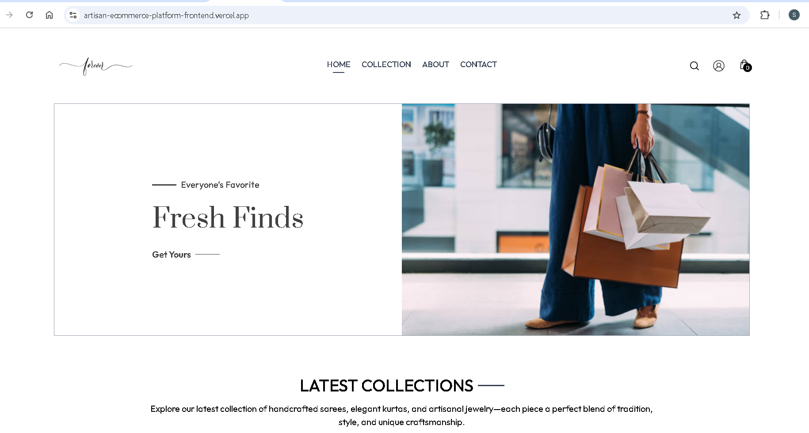
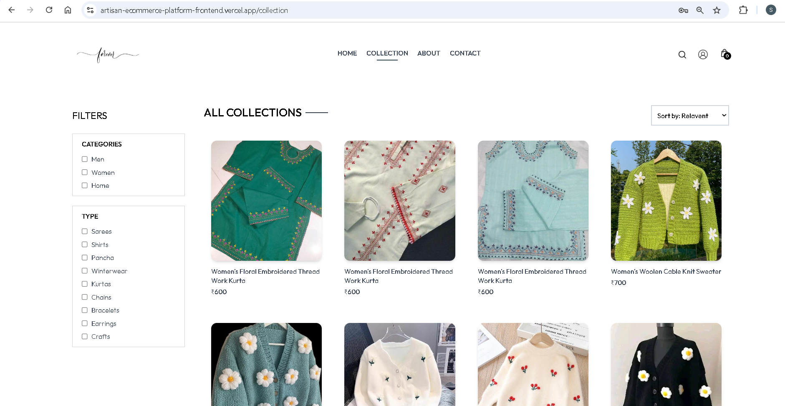
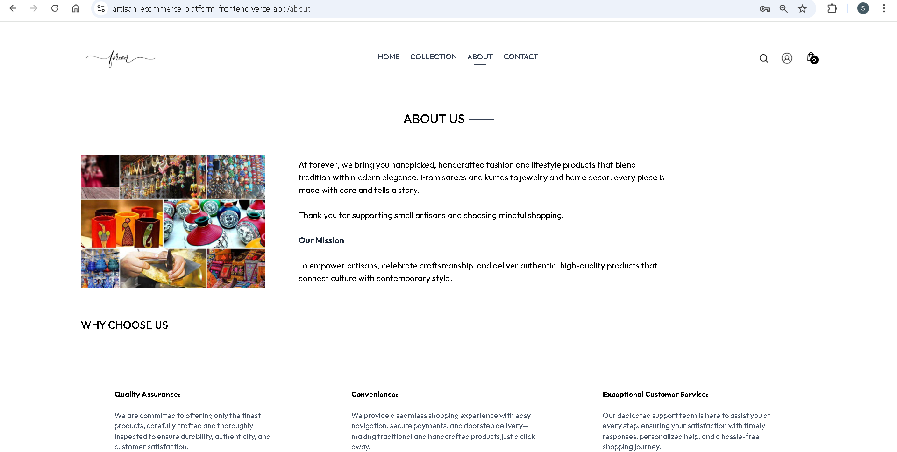

# Artisan-ecommerce-platform

An online marketplace dedicated to showcasing and selling exquisite handcrafted products, including sarees, panchas, jewelry, and traditional crafts. Built using the MERN stack (MongoDB, Express.js, React, Node.js), this platform connects artisans with customers seeking unique, handmade items.This project offers a robust platform for both users and admins, packed with essential features for a seamless experience.

**Features**
- **Artisan Onboarding** :Artisans can register, create profiles, and list their handcrafted products.

- **Product Catalog**: Browse a diverse collection of handcrafted sarees, panchas, jewelry, and crafts with detailed descriptions and images.

- **Shopping Cart & Checkout**: Add items to the cart, proceed to checkout, and manage orders seamlessly.

- **User Reviews & Ratings**: Customers can leave reviews and rate products to assist others in their purchasing decisions.

- **Admin Dashboard**: Admins can manage users, products, and orders from a centralized interface.

- **Responsive Design**: Optimized for mobile and desktop devices, ensuring a smooth shopping experience.

**Technologies Used**
- **Frontend**: React.js, Redux Toolkit, Tailwind CSS

- **Backend**: Node.js, Express.js

- **Database**: MongoDB

- **Authentication**: JWT (JSON Web Tokens)

- **Payment Integration**: Stripe (for secure payments)

- **Hosting**: Vercel

## Screenshots

# Home


# Collection


# About



You can access the demo user section by navigate to  (https://artisan-ecommerce-platform-frontend.vercel.app/)  and using the following credentials in profile section:

```plaintext
Username: admin@forever.com
Password: 12345678
```

To experience artisan-ecommerce as a admin user, navigate to (https://artisan-ecommerce-platform-admin-panel.vercel.app/) and use the following credentials:

```plaintext
Username: admin@forever.com
Password: 12345678
```

**Prerequisites**
- Node.js (v14 or higher)
- MongoDB
- npm or yarn

#Installation

Clone the repository
```
https://github.com/KashaveniSruthi/artisan-ecommerce-platform.git
```

**Frontend Setup**

Navigate to the client directory:

```bash
cd handloom_ecommerce
npm i cors dotenv express jsonwebtoken mongoose multer nodemon stripe validator cloudinary bcrypt
npm install axios react-router-dom react-toastify
npm run dev
```

Create a .env file in the client directory to store environment-specific variables:

```
VITE_BACKEND_URL=http://localhost:4000
```

**Backend Setup**
```bash
cd Backend
npm run server
```
Create a .env file in the Backend directory and add the following:
```
MONGO_URI=your_mongodb_connection_string
JWT_SECRET=your_jwt_secret
ADMIN_EMAIL = your email 
ADMIN_PASSWORD=your password
STRIPE_SECRET_KEY=your_stripe_secret_key
CLOUDINARY_CLOUD_NAME=your_cloudinary_cloud_name
CLOUDINARY_API_KEY=your_cloudinary_api_key
CLOUDINARY_API_SECRET=your_cloudinary_api_secret
```
**Admin Setup**
```bash
cd admin
npm run dev
```

Create a .env file in the admin directory and add the 
```
VITE_BACKEND_URL='http://localhost:4000'
```
## Contact

For inquiries or feedback, please reach out to:

Email: kashavenisruthi@gmail.com
